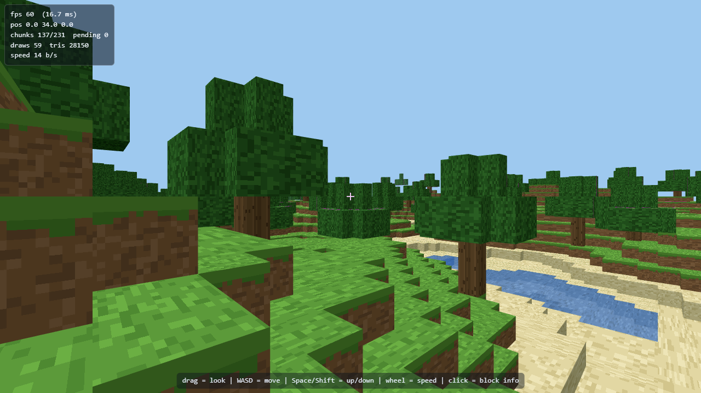

# minecraft-web — voxel engine (Three.js + Vite)

แกนกลางของเกม Minecraft-like ที่รันบนเบราว์เซอร์แบบ static ล้วน (ไม่มี backend)
ประกอบด้วย chunk system, greedy meshing, terrain generation ด้วย noise และ chunk manager
ที่สตรีม chunk รอบผู้เล่นแบบไม่บล็อกเฟรม

สถานะ: **public API ใน `src/engine/index.ts` พร้อมใช้แล้ว** และมี first person player module ใน `src/player/`
ใช้ต่อได้เลยสำหรับงาน dig-place / HUD / integration



## วิธีรัน

```bash
npm install
npm run dev          # http://localhost:5173  (dev server + HMR)
npm run build        # tsc --noEmit && vite build -> dist/ (static, เปิดจาก web server ใดก็ได้)
npm run preview       # เสิร์ฟ dist/ ที่ http://localhost:4173
npm run typecheck    # tsc --noEmit
```

`dist/` ตั้ง `base: './'` ไว้แล้ว ย้ายไปวางที่ path ไหนก็ได้

หน้า `/player.html` คือ first person gameplay demo: คลิกซ้ายเพื่อ lock เมาส์, WASD เดิน,
Shift วิ่ง, Space กระโดด, ESC ปลด lock

## Player module

โค้ดอยู่ที่ `src/player/` และเชื่อมกับ engine ด้วย `FirstPersonPlayer.mount(game)`
ซึ่งใช้ `game.onFrame()` จึงอัปเดตผู้เล่นก่อน chunk streaming และ render ในเฟรมเดียวกัน

```ts
import { createGame } from './engine';
import { FirstPersonPlayer } from './player';

const game = createGame(canvas, { controls: 'none' });
const spawn = game.world.spawnPoint(0, 0);
const player = new FirstPersonPlayer({
  world: game.world,
  camera: game.camera,
  element: canvas,
  position: [spawn.x, spawn.y, spawn.z],
});
player.mount(game);
```

รายละเอียดค่าฟิสิกส์, keymap, collision และวิธีทดสอบอยู่ใน `docs/player-controller.md`

## ปุ่มควบคุมในเดโม

ลากเมาส์ = หมุนกล้อง, WASD = เคลื่อนที่, Space / Shift = ขึ้น / ลง, ลูกกลิ้ง = ปรับความเร็ว,
คลิก = ยิง raycast แล้วโชว์ข้อมูลบล็อกที่เล็ง (ผ่าน `window.__VOXEL`)

## Public API (สัญญา)

```ts
import { createGame, Block, type BlockId } from './engine';

const game = createGame(canvas, { seed: 1337, renderDistance: 6 });

world.getBlock(x, y, z): BlockId          // 0 = AIR, อ่านนอกโลก/nอกช่วง y ได้คืน AIR
world.setBlock(x, y, z, id): void         // เขียนแล้ว mark chunk (และ chunk ข้างเคียงถ้าติดขอบ) ให้ remesh เอง
world.raycast(origin, direction, maxDist): RaycastHit | null
createGame(canvas, opts): Game            // { scene, camera, world, renderer, onFrame(cb), dispose(), ... }
```

`RaycastHit = { position: [x,y,z], normal: [x,y,z], blockId, distance }`
`position` เป็นพิกัด voxel (จำนวนเต็ม), `normal` คือหน้าที่ลำแสงเข้า (เป็น [0,0,0] ถ้าเริ่มในบล็อกทึบ)
raycast ข้ามน้ำ (liquid) ไปโดนของแข็งข้างหลังเสมอ (เหมือน Minecraft ที่เล็งน้ำไม่ได้)

`createGame` คืน `Game`:

| field | ความหมาย |
|---|---|
| `scene` | `THREE.Scene` (มี light/group ของ chunk อยู่แล้ว) |
| `camera` | `THREE.PerspectiveCamera` |
| `world` | `World` ตามสัญญาข้างบน |
| `renderer` | `THREE.WebGLRenderer` |
| `onFrame(cb: (dt:number)=>void)` | ลงทะเบียน callback คืน unsubscribe; **เรียกก่อน** chunk streaming และ render ในเฟรมถัดไป |
| `start()` / `stop()` | เปิด/หยุด loop (auto-start เป็นค่าเริ่มต้น) |
| `stats()` | `{ fps, frameMs, drawCalls, triangles, geometries, textures, programs, world }` |
| `dispose()` | หยุด loop, ถอด listener, คืน geometry/material ทั้งหมด |

`GameOptions`: `seed`, `renderDistance` (default 6), `maxChunkOpsPerFrame` (default 2),
`controls: 'spectator' | 'none'` (default spectator), `fov`, `near`, `far`, `startPosition`,
`fog`, `background`, `maxPixelRatio`, `autostart`, `worldMaterial`

### helper เสริมที่ใช้บ่อย (ไม่ใช่สัญญา fix แต่มีให้แล้ว)

- `world.heightAt(x, z)` — ความสูงพื้นผิว (`TerrainGenerator.heightAt`)
- `world.spawnPoint(x, z)` — `Vector3` เหนือพื้นผิว 1 บล็อก ใช้เป็นจุดเกิดผู้เล่น
- `world.stats()` — `{ seed, renderDistance, chunks, meshed, pending, builds, rebuilds, unloads, vertices, triangles, quads }`
- `world.buildPendingChunks(maxOps)` / `buildAllPending()` — สั่ง mesh เองได้ (ใช้ในเทสต์)
- `Block` / `BLOCKS` / `getBlockDef(id)` / `isSolid` / `isOpaque` / `isLiquid`
- `TerrainGenerator`, `buildChunkMeshData`, `SimplexNoise`, `fbm2`, `mulberry32`, `SpectatorController`

## บล็อกและหิน/ดิน

| id | ชื่อ | ค่าใน `BLOCKS[id]` |
|---|---|---|
| 0 | AIR | ไม่มีอะไรเลย |
| 1 | GRASS | solid, opaque, hardness 0.6 |
| 2 | DIRT | solid, opaque, hardness 0.5 |
| 3 | STONE | solid, opaque, hardness 1.5 |
| 4 | SAND | solid, opaque, hardness 0.4 |
| 5 | WATER | ไม่ solid, ไม่ opaque, liquid, alpha 0.72 |
| 6 | WOOD | solid, opaque, hardness 1.2 |
| 7 | LEAVES | solid, opaque, hardness 0.3 |

`BlockDef` มี `hardness` (วินาที) และ `alpha` เผื่อให้งานขุด/วางกับงานเรนเดอร์ใช้ต่อได้เลย

## โครงสร้าง

```
src/engine/
  index.ts     public API (ห้ามเปลี่ยนชื่อ export ในนี้)
  world.ts     chunk manager: getBlock/setBlock/raycast, queue การ mesh, load/unload, stats
  chunk.ts     Chunk 16x16x64 เก็บ Uint8Array (index = (y*16+z)*16+x)
  terrain.ts   TerrainGenerator: simplex fBm 2 มิติ + ทรี, SEA_LEVEL = 26, deterministic ตาม seed
  mesher.ts    greedy meshing 3 แกน -> positions/normals/uv/color(4)/indices
  atlas.ts     texture atlas 4x4 tile (64x64px) วาดด้วย canvas + material เดียว
  noise.ts     mulberry32, SimplexNoise 2D, fbm2, hash01
  game.ts      createGame: scene/camera/light/fog/loop/resize/stats
  cameraRig.ts SpectatorController (กล้องชั่วคราวสำหรับเดโม engine)
src/player/
  index.ts     public player exports
  player.ts    FirstPersonPlayer: ต่อ input/look/physics กับ game.onFrame
  physics.ts   gravity, walk/sprint, jump และ ground handling
  collision.ts swept axis-separated AABB ขนาด 0.6 x 1.8
  input.ts     WASD/arrow/Space/Shift และ remappable keymap
  look.ts      pointer lock, drag fallback และ pitch clamp +/-89 องศา
src/main.ts    หน้า engine demo + HUD + window.__VOXEL
src/player-demo.ts หน้า first person demo + window.__PLAYER
src/interaction/
  index.ts     public interaction exports (ใช้ต่อจาก engine API เท่านั้น)
  controller.ts ขุด (กดค้าง ตาม hardness 0.3-1.5 วิ) + วาง + กฎปฏิเสธทุกข้อ
  inventory.ts hotbar 9 ช่อง, stack 64, add/take/select/cycle + serialize
  diffs.ts     EditTracker: diff เทียบ terrain ที่ generate จาก seed, apply เข้า chunk ที่โหลดอยู่
  storage.ts   SaveStore: localStorage, ตรวจ version/seed, กันข้อมูลเสีย/โควตาเต็ม
  session.ts   InteractionSession: ประกอบทุกอย่าง + autosave 10 วิ + reset world + debug info
  player.ts    PlayerBody (เท้า + AABB 0.6x1.8) และ adapter ที่ห่อกล้อง
  hud.ts       crosshair / progress bar / hotbar + ไอคอน / counts / debug F3 / toast / ปุ่ม reset
  highlight.ts กรอบเป้าบล็อก + แอนิเมชันตอนขุด
player.html    entry point ของ first person demo
interaction.html entry point ของ interaction demo (ขุด/วาง/HUD/save)
tests/         engine, player และ interaction smoke/browser tests
docs/save-format.md  รูปแบบไฟล์ save: เก็บอะไรบ้างและโหลดกลับอย่างไร
```

## ค่าที่ใช้จริง

- chunk 16x16x64 (x, z, y) = 16,384 บล็อก/chunk, `CHUNK_HEIGHT = 64`
- render distance 6 chunk (แผนที่ chunk เป็นวงกลมรัศมี `d² <= R²+R` = 137 chunk) + เก็บเกินไว้อีก 1 วง (`unloadMargin`)
- mesh ต่อเฟรมสูงสุด `maxChunkOpsPerFrame` (default 2) → เฟรมไม่สะดุดตอนโหลด
- terrain: `heightAt` = simplex fBm (2 octave sets + ridge) ช่วงความสูงจริงประมาณ y 12-45, ระดับน้ำ 26
  ผิว: GRASS (หรือ SAND ถ้าสูง <= SEA_LEVEL+1), ใต้ผิว 3 บล็อกเป็น DIRT/SAND, ลึกลงไป STONE, y=0 เป็น STONE
  ต้นไม้: WOOD สูง 4-6 + ใบ LEAVES (มี margin 3 บล็อก ต้นที่คร่อมขอบ chunk จึงไม่ขาด)
- 1 material ต่อทั้งโลก (`MeshLambertMaterial` + vertex colors RGBA) → draw call = จำนวน chunk ที่เห็น
- greedy meshing รวม quad เฉพาะ face ที่ติดกันชนิดเดียวกัน → ลด quad ลง ~3-8 เท่า (16x16 slab 576 faces → 6 quads)

## Interaction: ขุด/วาง + hotbar/HUD + save/load

งานของ task `t_ff52a7e8` อยู่ใน `src/interaction/` และใช้ **เฉพาะ** public API ของ engine
(`world.getBlock`, `world.setBlock`, `world.raycast`) ไม่แก้ engine แม้แต่บรรทัดเดียว

```ts
import { InteractionSession, createFirstPersonPlayerAdapter } from './interaction';

const player = new FirstPersonPlayer({ world: game.world, camera: game.camera, element: canvas });
const session = new InteractionSession({
  world: game.world,        // ต้องมี getChunk(cx, cz) ด้วย (World มีอยู่แล้ว)
  scene: game.scene,        // วาดกรอบเป้าบล็อก
  player: createFirstPersonPlayerAdapter(player), // ห่อ FirstPersonPlayer ของ src/player
  seed: 20260924,
  atlasCanvas: atlas.canvas, // ไอคอน hotbar
  hudOptions: { status: '...' },
});
game.onFrame((dt) => {
  player.update(dt);        // ของเดิม
  session.update(dt);       // ขุด/วาง/HUD/autosave/apply edit
});
// อินพุต: session.controller.beginDig()/endDig()/beginPlace()/endPlace(),
//         session.handleKeyDown(event) (1-9, F3), session.handleWheel(deltaY)
```

สร้าง `FirstPersonPlayer` ให้เสร็จ **ก่อน** สร้าง session (constructor ของมันเรียก `physics.settle()`
ให้ยืนบนผิวโลก) เพราะ session จะจำตำแหน่ง/มุมมองตอนนั้นไว้เป็นจุดเกิดของปุ่ม reset
ถ้าอยากขุด/วางด้วยกล้องแทนร่างกาย ใช้ `createCameraPlayerAdapter(camera)` ได้

- **ขุด**: กดคลิกซ้ายค้าง เป้าคือ raycast 5 บล็อก, progress = `dt * digSpeed / getBlockDef(id).hardness`
  (0.3 วิ ใบไม้ → 1.5 วิ หิน) ครบแล้วบล็อกเป็น AIR + ไอเทมเข้าช่องแรกที่รับได้ + ถ้าของเต็มจะแจ้งผ่าน `onInventoryFull`
  เปลี่ยนเป้า/ปล่อยเมาส์/เป้าหลุด → progress รีเซ็ตเป็น 0
- **วาง**: คลิกขวา วางที่ `hit.position + hit.normal` ปฏิเสธพร้อมเหตุผลเมื่อ: ไม่มีเป้า (`no-target`),
  ลำแสงเริ่มในบล็อก (`inside-block` — กันวางลอย), เลยขอบโลก (`out-of-world`), ช่องไม่ว่าง (`occupied`),
  ทับ AABB ผู้เล่น (`player-box`), มือว่าง (`empty-hand`) — วางสำเร็จจึงหักของ 1 ชิ้น
- **hotbar**: 9 ช่อง ปุ่ม 1-9 และ wheel, เริ่มต้นหญ้า/ดิน/หิน/ทราย/ไม้ อย่างละ 64, stack 64
- **HUD**: crosshair, progress bar, เลขช่องที่เลือก, จำนวนของทุกช่อง, toast, debug overlay (F3) =
  fps/frame time, พิกัด+มุมมอง, chunk ที่โหลด/meshed/pending, เป้าปัจจุบัน, จำนวน edit, เวลาที่เซฟล่าสุด
  ทั้ง overlay เป็น `pointer-events: none` ยกเว้นปุ่ม reset → ไม่บังการเล่น
- **save/load**: diff จาก terrain + ตำแหน่งผู้เล่น + hotbar ลง localStorage ทุก 10 วิ (และตอนปิด/ซ่อนแท็บ)
  โหลดกลับอัตโนมัติเมื่อเปิดหน้าใหม่ กดปุ่ม reset world สองครั้งเพื่อคืนโลกเป็น terrain ตั้งต้น
  รายละเอียดรูปแบบไฟล์: [`docs/save-format.md`](docs/save-format.md)

### ปุ่มในหน้า interaction demo

`npm run dev` แล้วเปิด `/interaction.html` (หรือ `npm run preview` → `/interaction.html`)

| ปุ่ม | ทำอะไร |
|---|---|
| คลิกซ้ายค้าง | ขุดบล็อกที่เป้า (กรอบดำ + progress bar ที่กลางจอ) |
| คลิกขวา | วางบล็อกจากช่องที่เลือก |
| 1-9 / ล้อเมาส์ | เลือกช่อง hotbar |
| F3 | เปิด/ปิด debug overlay |
| คลิกที่จอ | ล็อกเมาส์ (ESC ปล่อย) |
| WASD, Space, C, Shift | บินในเดโมนี้ (เป็น rig สาธิต ไม่มีแรงโน้มถ่วง; ตัวจริงคือ `src/player/`) |
| ปุ่ม Reset world (ขวาบน) | คลิกสองครั้ง = ล้างโลก ผู้เล่น และ save |

## ผลการตรวจสอบ (วัดจริง ไม่ได้ประมาณ)

รันบน Lenovo Yoga 7i (Intel Arc 140V, ANGLE/D3D11, WebGL 2.0), Chrome ผ่าน CDP, viewport 1280x720:

| สิ่งที่วัด | ผล |
|---|---|
| `npm run typecheck` / `npm run build` | ผ่านทั้งคู่ ไม่มี type error เหลือ (`tsc --noEmit` เงียบ) |
| `npx tsx tests/engine.smoke.test.ts` | 62 checks ผ่านทั้งหมด (terrain/mesher/raycast/chunk manager) |
| `npx tsx tests/player.smoke.test.ts` | 114 checks ผ่านทั้งหมด (physics/collision/input/look/player wiring) |
| `node tests/browser.test.mjs` | 23 checks ผ่านทั้งหมด |
| `node tests/player.browser.test.mjs` | 41 checks ผ่านทั้งหมด, first person 120 fps ใน acceptance arena |
| `npx tsx tests/interaction.smoke.test.ts` | 117 checks ผ่านทั้งหมด (hotbar, diff, ขุดตาม hardness, กฎการวางทุกข้อ, save/load/reset, ต่อกับ `FirstPersonPlayer` จริง) |
| `node tests/interaction.browser.test.mjs` | 56 checks ผ่านทั้งหมด, รันซ้ำ 3 รอบไม่ flake (เมาส์/คีย์บอร์ด/wheel จริง, autosave 10 วิ จริง, reload แล้วโลกเหมือนเดิม, ปุ่ม reset) |
| fps ของหน้า interaction | 120.0 fps (8.34 ms/เฟรม) หลัง chunk ครบ 137 chunk — headless + swiftshader, vsync ปิด |
| fps | 60.0 fps (16.7 ms/เฟรม, ติด vsync) ทั้งตอนยืนนิ่งและหลังเดิน 960 บล็อก |
| chunk ที่ render | 137 chunk (ทั้งวง), draw call 53-55, ~25-28k triangles, 60 draw ไม่มี spike |
| memory ตอนเดินไกล | chunk ในหน่วยความจำคงที่ 145 ตลอด 6 จุด (walk 960 บล็อก), GPU geometry 57-61, unload สะสม 814 |
| ความครบของ mesh | ยิง ray ผ่าน frustum ทั้งจอ: 100% โดนพื้น (มองลง), 97.5% (มุมใกล้พื้น), 66.9% (มุมขอบฟ้า) ตรงกับข้อมูลบล็อก |
| รูใน mesh | เปลี่ยน background เป็น magenta แล้วมองตรงลง: 0.00% พิกเซลที่เป็น background |
| API ในเบราว์เซอร์ | getBlock/setBlock/raycast ทำงานจริง, setBlock สั่ง remesh จริง (rebuild ภายใน 1 เฟรม) |

เทสต์เบราว์เซอร์ต้องมี Chrome ที่ `C:/Program Files/Google/Chrome/Application/chrome.exe`
(override ด้วย `CHROME_PATH`) และต้องมี server เสิร์ฟอยู่ (`npm run preview` แล้วตั้ง `PAGE_URL` ถ้าไม่ใช่ 4173)

## ข้อจำกัดที่รู้อยู่ (ตั้งใจให้เรียบง่าย)

- ยังไม่มี ambient occlusion / แสงจากบล็อก — ใช้สี vertex ต่อหน้า (บนสว่าง ด้านกลาง ล่างมืด)
- greedy meshing รวม quad ใหญ่แล้วยืด UV ของ tile นั้นให้เต็ม quad (nearest filter) — texture จึงดูเป็นก้อนใหญ่
  ไม่ repeat ตามจำนวนบล็อก (แก้ได้ด้วย data-array texture + shader patch ถ้าต้องการเป๊ะ)
- น้ำจมอยู่ใน mesh เดียวกับของแข็ง และใช้ alpha จาก vertex color (0.72) ไม่มีการ sort ใบน้ำแยก
- collision/ฟิสิกส์/player controller มีแล้วใน `src/player/`; ขุด/วาง + hotbar/HUD + save/load เสร็จแล้วใน `src/interaction/`
- save เก็บเฉพาะ diff จาก terrain + ตำแหน่งผู้เล่น + hotbar (ดู `docs/save-format.md`) — ไม่มี sync ข้ามเครื่อง/หลายโปรไฟล์
  และผู้เล่นที่ถูกวางทับ (block ที่อยู่ในตัว) จะไม่ถูกดันออก แต่ระบบวางจะปฏิเสธไม่ให้เกิดตั้งแต่แรก

## งานถัดไปที่ต่อจาก engine นี้

- player controller เสร็จแล้วใน `src/player/`; ใช้ `createGame(canvas, { controls: 'none' })`
  แล้วสร้าง `FirstPersonPlayer({ world: game.world, camera: game.camera, element: canvas })`
  จากนั้น `player.mount(game)` เพื่อให้ callback ทำงานก่อน streaming + render
- ขุด/วาง + hotbar/HUD + save/load: **เสร็จแล้ว** ใน `src/interaction/` (ดูหัวข้อ "Interaction" ข้างบน และ `docs/save-format.md`)
  สิ่งที่เหลือคือ *รวมของจริง* เข้าหน้าเดียว (งานของ `t_5f9c7bb5`): สร้าง `FirstPersonPlayer` แล้วห่อด้วย
  `createFirstPersonPlayerAdapter(player)` ส่งให้ `new InteractionSession({...})`, ต่อเมาส์ซ้าย/ขวาเข้ากับ
  `session.controller.beginDig/endDig/beginPlace/endPlace`, ส่ง keydown ให้ `session.handleKeyDown(event)` ก่อน
  (เพื่อไม่ให้ 1-9/F3 ไปถึง player) และ wheel ให้ `session.handleWheel(deltaY)`
